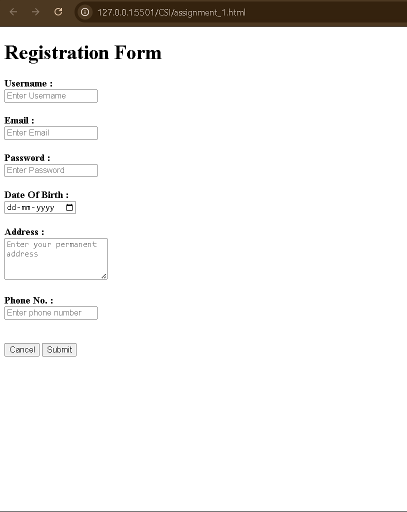
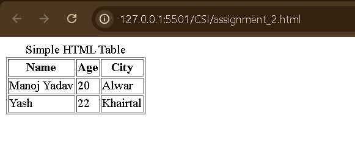
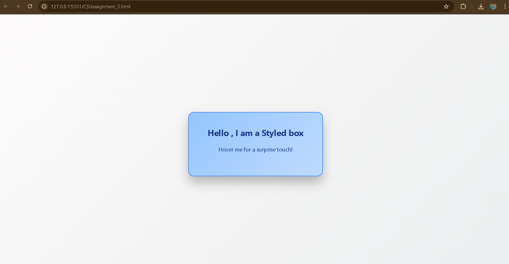
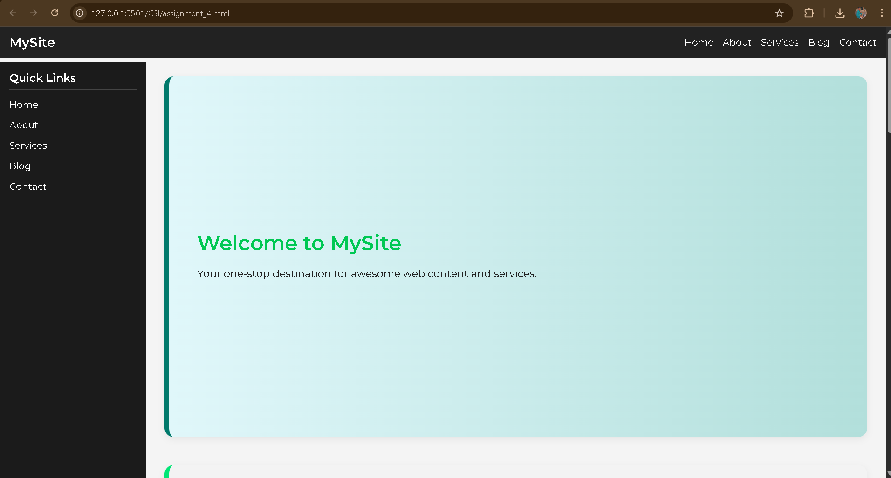
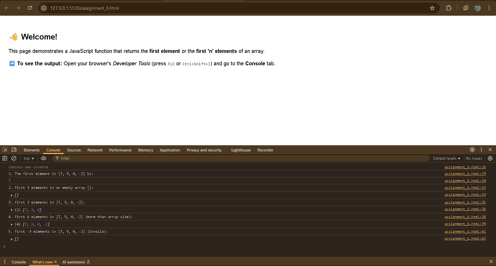
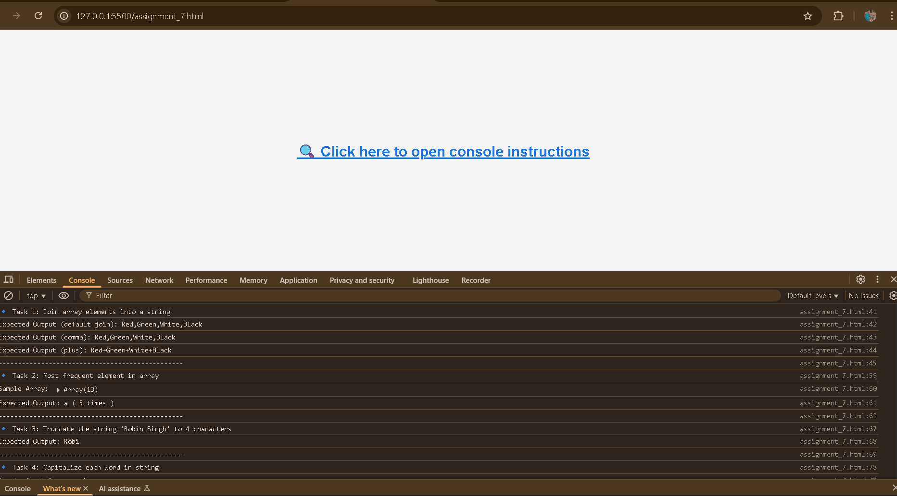

# CSI_Assignments

👨‍💻 **Intern at Celebal Technologies**  
These are the HTML & CSS assignments given to me during my internship at Celebal Technologies as part of the CSI program.

---

## 📚 Assignments Overview

### 🔹 Assignment 1: User Registration Form
- **Description**: Created a basic user registration form using only HTML.
- **Fields**:
  - Username
  - Email
  - Password
  - Birthdate
  - Address
  - Phone number
- **Buttons**: Submit and Cancel
- **File**: `assignment_1.html`

---

### 🔹 Assignment 2: HTML Table
- **Description**: Created a simple HTML table with 3 rows and 3 columns.
- **Columns**:
  - Name
  - Age
  - City
- **File**: `assignment_2.html`

- 

---

### 🔹 Assignment 3: Styled Box
- **Description**: Designed a box using basic CSS properties.
- **Styles Used**:
  - Background Color
  - Border
  - Font Style
  - Margin
  - Padding
- **File**: `assignment_3.html`

---

### 🔹 Assignment 4: Responsive Web Page with Sidebar
- **Description**: Built a responsive HTML layout with multiple content sections and a sidebar using Flexbox and Grid.
- **Features**:
  - Sticky header
  - Collapsible sidebar for mobile
  - Smooth scrolling navigation
  - Responsive design with media queries
- **Files**:
  - HTML: `assignment_4.html`
  - CSS: `style_4.css`

---

### 🔸 Assignment 5: Animated Theme Toggle Buttons

## 📌 Description
This project showcases **animated and interactive buttons** that allow users to switch between different background themes with smooth transitions and live visual effects.

Each theme comes with unique CSS animations (like raindrops, clouds, or sun rays) that enhance the user experience while practicing DOM manipulation, CSS transitions, and responsive interactivity.

## ✨ Features

- 🌙 **Dark Theme**
- 🌤 **Sky Theme** 
- ☀️ **Sunny Theme** 
- 🌧️ **Rainy Theme** 
- 🔁 Toggle back to default (white) theme by pressing the same button
- 🎨 CSS animations and keyframes for each effect
- 🚀 Smooth button transitions and pulse animation

## 📁 Files Included

  assignment_5.html - Main HTML file with theme toggle buttons         
  Inline CSS/JS     - CSS and JavaScript are embedded within the HTML  
  screenshots/      - Folder with visual previews of each theme        

## 🖼️ Preview

Add these image files inside a `screenshots/` folder and refer to them like this:

.png)
.png)
.png)

---

###🔹 Assignment 6: JS Array `first()` Function

## 📌 Description
This assignment demonstrates a JavaScript function `first()` that:
- Returns the first element of an array.
- If `n` is passed, returns the first `n` elements.
- Handles edge cases like empty arrays and negative `n`.

## 🖥️ How to Use
1. Open `assignment_6.html` in any browser.
2. Read the instructions shown on the page.
3. Open the **Console tab** (F12 or Ctrl+Shift+I) to see results.

## 🧪 Sample Outputs
javascript
-first([7,9,0,-2])          // 7
-first([], 3)               // []
-first([7, 9, 0,-2], 3)    // [7, 9, 0]

## 🖼️ Screenshot:

Below is the screenshot showing the web page and console output:

---

### 🔸 Assignment 7: JavaScript Array & String Exercises

### 📄 Description:
This assignment covers multiple basic JavaScript tasks related to arrays and strings, including joining arrays, finding frequent elements, string manipulation, and filtering.

---

### ✅ Tasks Implemented:
1. **Join Elements** – Join all elements of an array into strings using `.join()`.
2. **Find Most Frequent Element** – Count and display the most frequent item in an array.
3. **Truncate String** – Cut a string to a given number of characters.
4. **Capitalize Words** – Convert each word’s first letter to uppercase.
5. **Filter Between** – Return array elements between two given numbers.

---

### 🧪 Test Data & Expected Output:
js
console.log(myColor.join());              // "Red,Green,White,Black"
console.log(myColor.join('+'));           // "Red+Green+White+Black"

console.log(`${mostFrequent} (${maxFreq} times)`); // a (5 times)

console.log(truncateString("Robin Singh", 4));     // "Robi"

console.log(capitalizeWords('js string exercises')); // "Js String Exercises"

console.log(arrBetween(3, 8, [1, 5, 95, 0, 4, 7]));    // [5, 4, 7]

## 🖼️ Screenshot:

Below is the screenshot showing the web page and console output:

---

### 🔸Assignment 8 – Git Commands

1. Stage all changes and commit  
2. Move commits to correct branch  
3. Create branch, commit, and push  
4. Fork, change, and pull request  
5. Resolve merge conflicts  
6. Create feature branch from updated main  
7. Revert to specific commit  
8. Restore deleted file

---
